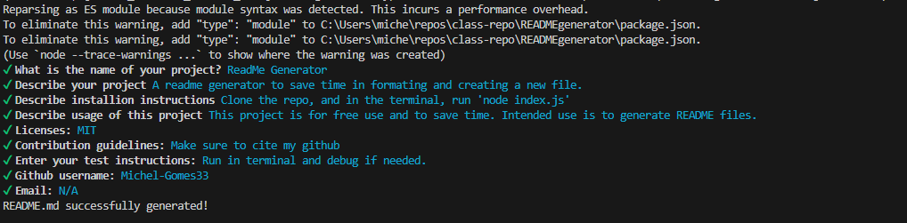
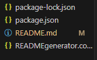

# ReadMe Generator

No license.

## Description

A readme generator to save time in formating and creating a new file.

## Table of Contents

- [Installation](#installation)
- [Usage](#usage)
- [Demo](#Demo)
- [License](#license)
- [Contributing](#contributing)
- [Tests](#tests)
- [Questions](#questions)

## Installation

Clone the repo, and in the terminal, run 'node index.js'

## Usage

This project is for free use and to save time. Intended use is to generate README files.

## Demo

<h3>Generated File:</h3>

<h3>Terminal:</h3>

<h3>Video Demo</h3>

## License

This project is licensed under the MIT license.

## Contributing

Make sure to cite my github

## Tests

undefined

## Questions

For any questions, please contact me at [N/A](mailto:N/A).

Check out my GitHub profile: [Michel-Gomes33](https://github.com/Michel-Gomes33)
    